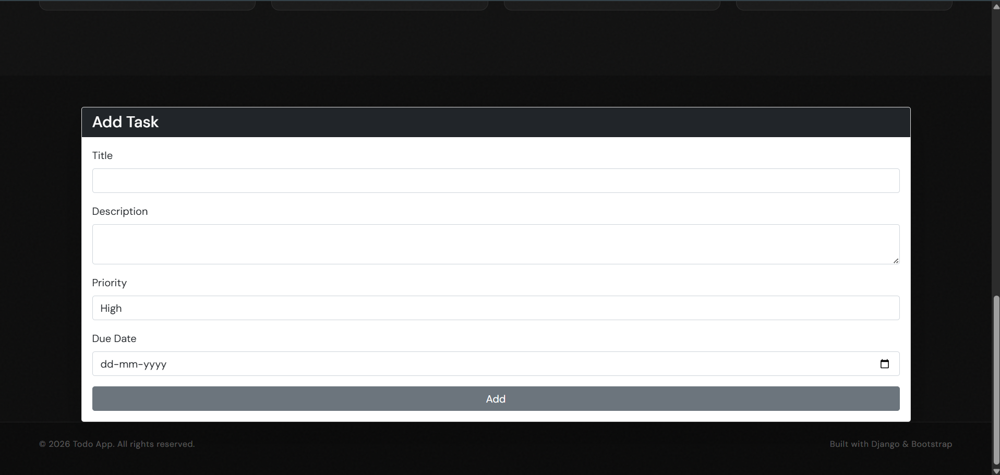
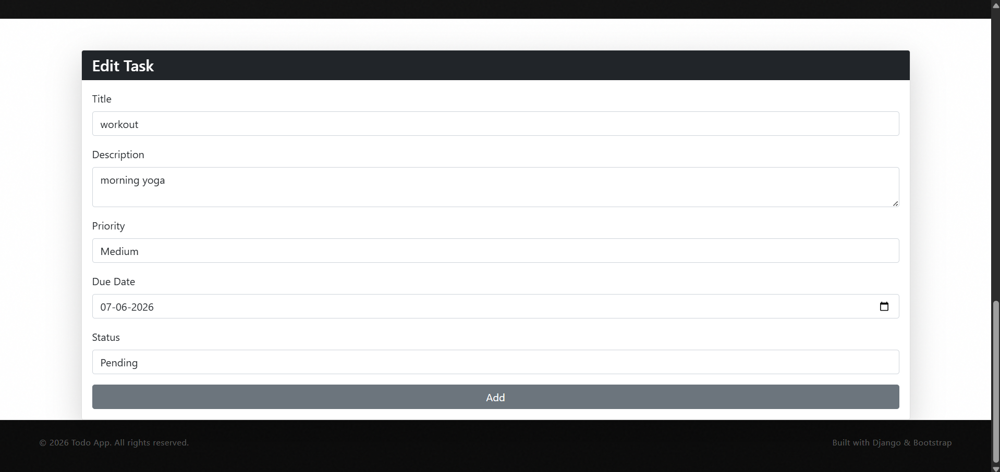
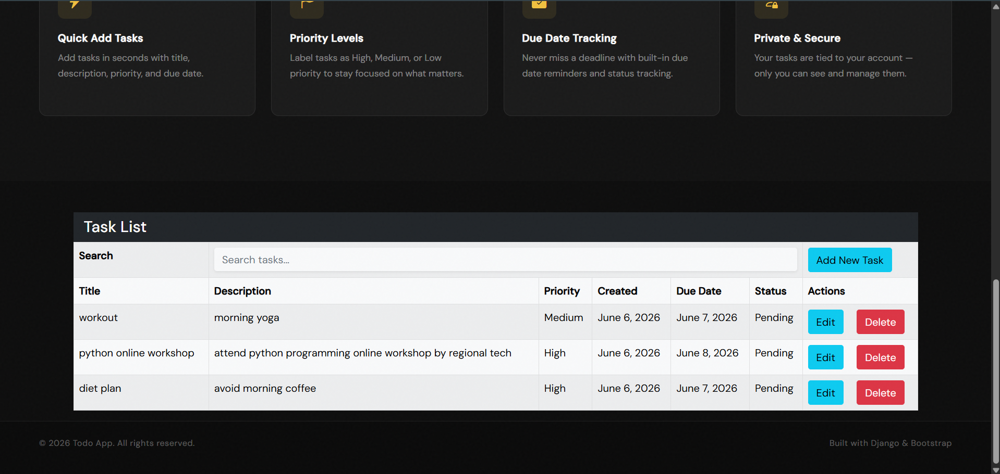
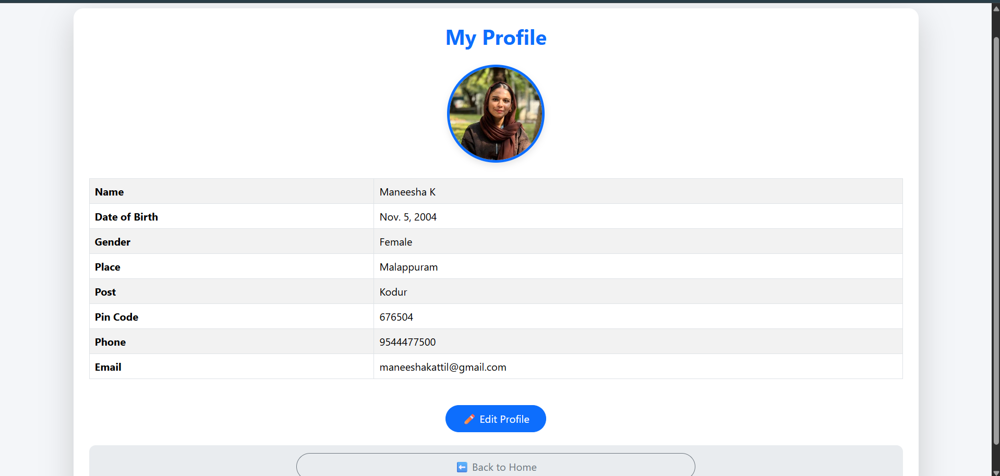
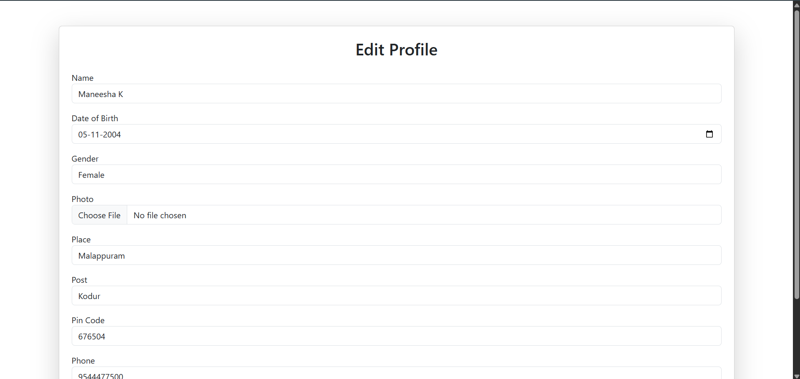

# 📝 Todo App (Django)

A simple and efficient Todo web application built using **Django** that helps users manage their daily tasks easily. Users can add, update, delete, and mark tasks as completed.

---

## 🚀 Features

- ➕ Add new tasks
- ✏️ Edit existing tasks
- 🗑️ Delete tasks
- ✅ Mark tasks as completed
- 📋 View all tasks in a clean UI
- 💾 Database storage using SQLite

---

## 🛠️ Tech Stack

- Python 🐍
- Django 🌐
- MySQL 🗄️
- HTML, CSS 🎨
- Bootstrap (UI styling)

---

## 📸 Screenshots

### 🏠 Home Page

### ➕ Add Task

### ✏️ Edit Task

### 📋 View Tasks

---

## 👤 Profile Section

### 👁️ View Profile

### ✏️ Edit Profile

